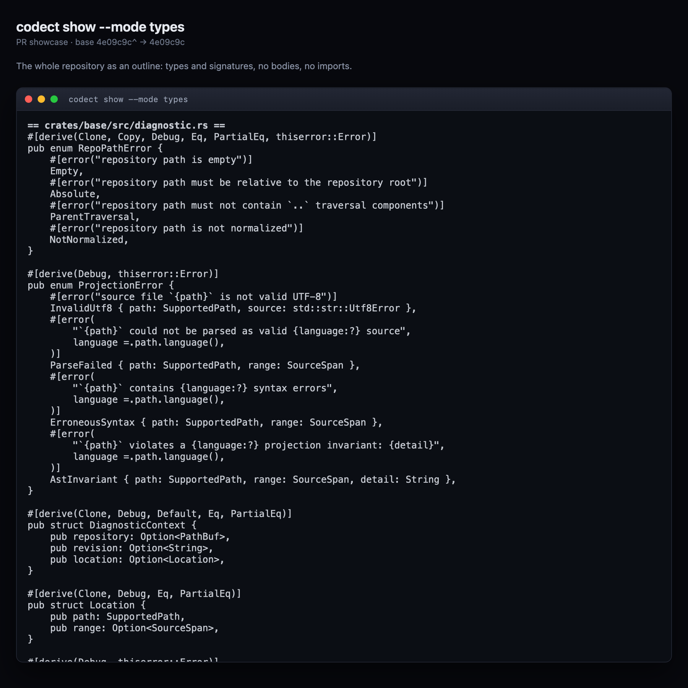
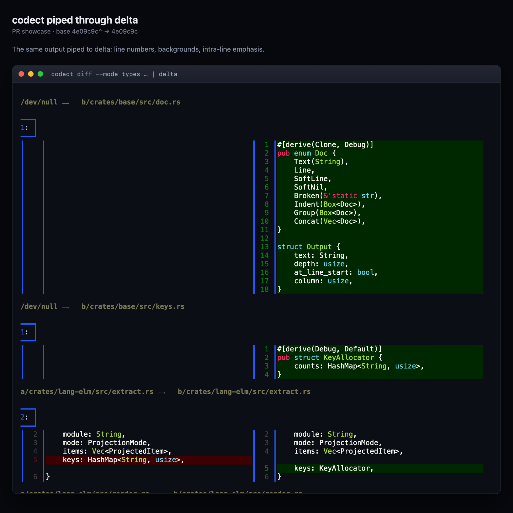
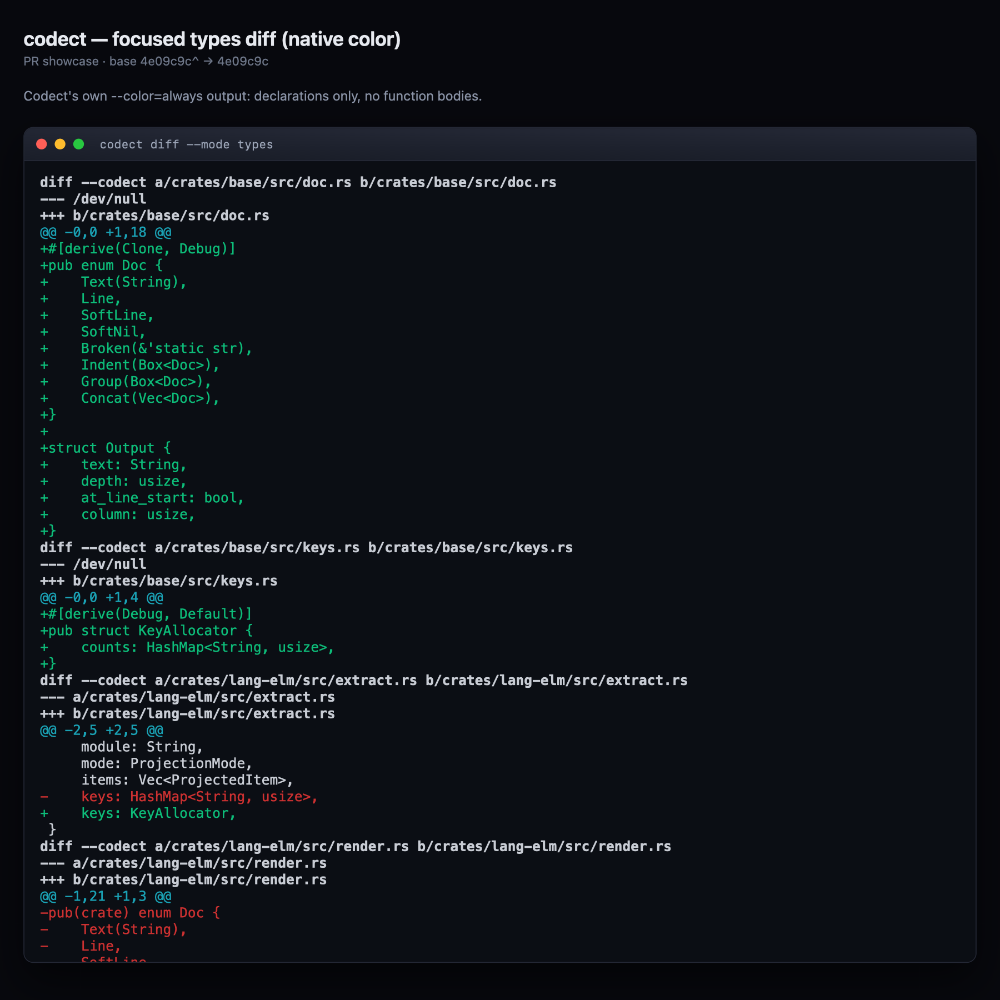

# Using the CLI

Codect provides selectable views of a codebase at different levels of detail.
Its focused views remove implementation bodies so you can study the shape of the
code without reading how it works. `PRODUCT.md` is authoritative for behavior
and scope.

## Commands

```text
codect show --format <text|json> --mode <types|signatures> [--path <PATH> | --area <AREA>]... [REVISION]
codect show --format json --mode <types|signatures> --stdin    --path <FILE>
codect show --format json --mode <types|signatures> --worktree --path <FILE>
codect diff --format <text|json> --mode <types|signatures> [--path <PATH> | --area <AREA>]... <BASE> <TARGET>
```

- `show` defaults `REVISION` to `HEAD`.
- `--mode` is required. `types` shows type declarations; `signatures` adds every
  named function, method, and value signature. Function bodies are never shown.
- `--format` defaults to `text`, the canonical projection. `--format json` emits
  the versioned documents described below.
- `diff` takes two independent revisions (not a range). Text diff requires
  commits; JSON diff also accepts the snapshots `:index`, `:worktree`, `:empty`,
  and the canonical Git empty-tree object ID.
- `--color <auto|always|never>` defaults to `auto`; redirected output never
  contains escape bytes.

Examples:

```sh
codect show --mode types
codect show --mode signatures --path src/auth.rs
codect show --mode signatures --area frontend
codect diff --mode types HEAD~1 HEAD
codect diff --format json --mode types HEAD :index       # staged changes
codect diff --format json --mode types :index :worktree  # unstaged changes
```

`show` renders the whole repository as an outline:



*`codect show --mode types` — every type declaration, no bodies, no imports.*

## Path scoping

`--path`/`-p` is repeatable and narrows a command to a file or directory (a
directory includes everything beneath it). A path that names nothing in the
projected revision — or in either side of a diff — is an error. A path that
exists but contains no supported files is valid and produces empty output.

Paths are relative to the current directory and must stay inside the repository.
Resolution is lexical: `.`, repeated slashes, and trailing slashes are
normalized, and `..` may climb but may not leave the repository. Matching is
byte-exact and respects path boundaries, so `src` does not match `src2/lib.rs`.

## Named areas

`--area`/`-a` is repeatable and selects named path groups defined in
`.codect.toml` at the repository root. Area paths are relative to the repository
root and are read only when `--area` is used. `--area` and `--path` cannot be
combined.

```toml
[areas]
frontend = ["apps/web", "packages/ui"]
backend  = ["services/api"]
```

An area is satisfied when any one of its paths names something in the projected
revision, or in either side of a diff. A missing or malformed config, or an area
name the config does not define, is an error. Areas are declarative data: names
and literal paths only, no globs, no substitutions.

## Focused diffs

A focused diff compares the selected projections of two snapshots, not their
complete source text. Implementation-only changes are intentionally invisible:
if a function body changes while its projected declaration is unchanged, the
focused diff shows no change for that function. Files with equal projections are
omitted, so an empty result means there are no focused changes.

`:index` reads stage-zero blob bytes. `:worktree` reads tracked regular files on
disk and does not follow symlinks; it does not include unsaved editor buffers or
untracked files. Mutable snapshot names are labels, so refresh after staging or
file writes.

## Text output

`show` uses a neutral per-file header:

```text
== src/User.elm ==
<canonical projection>
```

`diff` uses familiar Git-style headers, `/dev/null` for an absent side, and only
files whose projections differ.

## Prettier output

`codect diff` emits a plain unified diff, so it composes with any diff viewer.
Piping it through [`delta`](https://github.com/dandavison/delta) adds line
numbers, added/deleted backgrounds, and intra-line emphasis:



For comparison, codect's own `--color=always` output:



When delta's output is not a terminal it wraps at 80 columns and inserts a `↴`
marker; pass `--width=<n>` above the content width to avoid it.

## JSON output

- `codect show --format json` emits `codect.show.v1`: the requested mode's
  projection plus a complete, mode-independent outline for building semantic
  folds. It pairs with the editor projection surface and the Neovim plugin.
- `codect diff --format json` emits `codect.diff.v1` for commits and the
  snapshots `:index`, `:worktree`, and `:empty`.

Both are versioned by a `schema` field and documented at
[`docs/schema/`](schema/). For the exact contract, see
[CLI and JSON contract](agents/CONTRACT.md).

## Exit codes

| Code | Meaning |
| --- | --- |
| `0` | Success, including a diff with focused changes and a selection with no supported files (empty output). |
| `1` | Fatal: no repository, bad revision, absent path, config/area failure, non-UTF-8 source, parse failure. Empty stdout, one diagnostic on stderr. |
| `2` | Usage error. |

## Next

- [Terminal UI](TUI.md)
- [Neovim plugin](../editors/nvim/README.md)
- [Product](PRODUCT.md)
