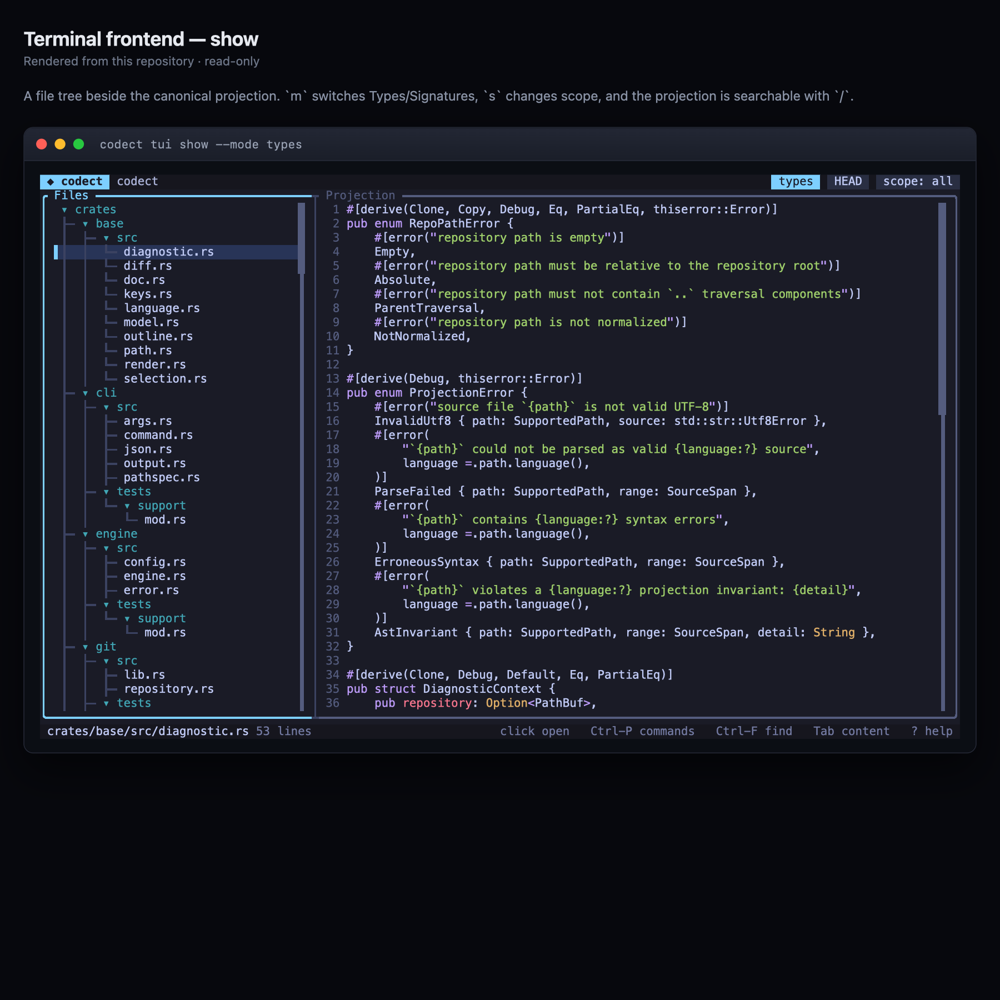
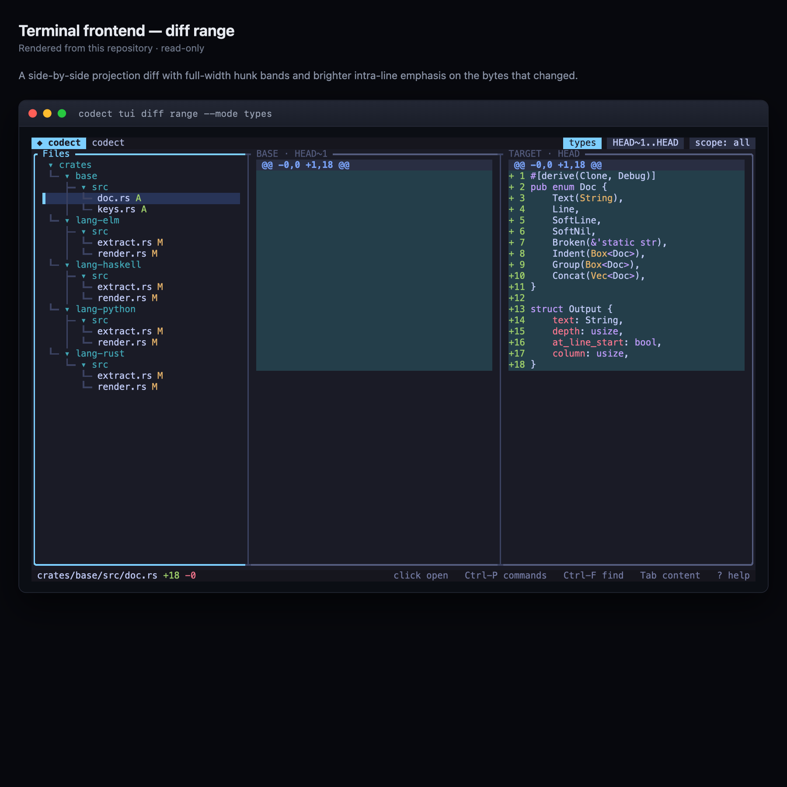
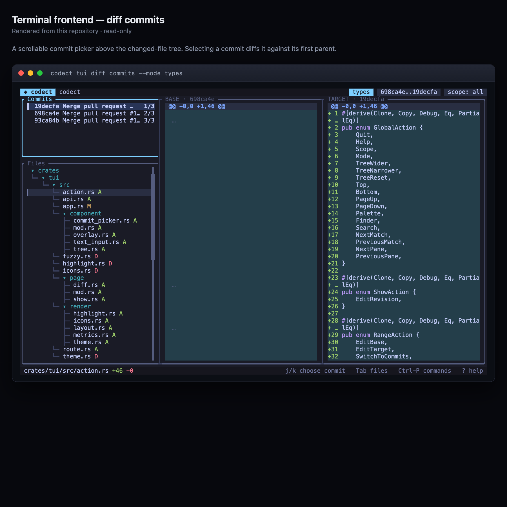
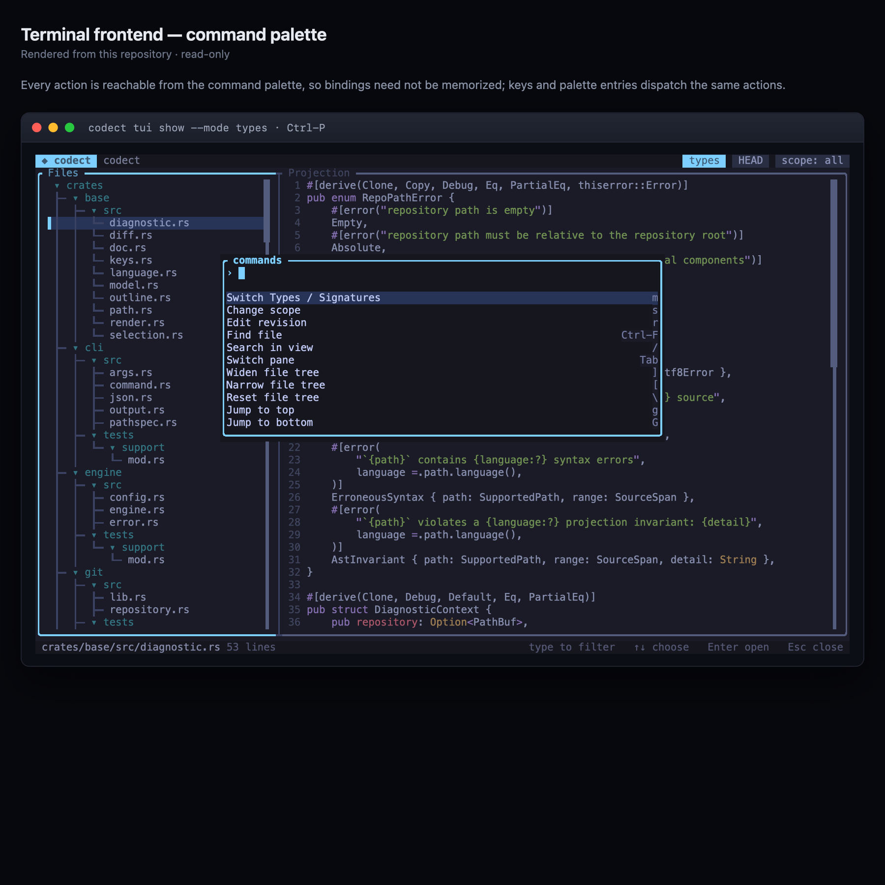

# Terminal UI

`codect` ships an interactive terminal browser for the same focused projections.
It is a default-on feature of the CLI.

## Launch

```text
codect tui show --mode <types|signatures> [--path <PATH> | --area <AREA>]... [REVISION]
codect tui diff range --mode <types|signatures> [--merge-base] [--path <PATH> | --area <AREA>]... <BASE> <TARGET>
codect tui diff commits --mode <types|signatures> [--path <PATH> | --area <AREA>]... <BASE> <TARGET>
```

- `tui show` opens a file tree beside the canonical projection of the selected
  file.
- `tui diff range` compares the two endpoint snapshots directly; either side
  may be a commit, `:index`, `:worktree`, or `:empty`, as in `codect diff`.
  `--merge-base` replaces the base with the merge base of the two commits and
  labels the base pane, matching `codect diff`.
- `tui diff commits` lists the commits after `BASE` through `TARGET` on
  `TARGET`'s first-parent chain, newest first; selecting a commit compares it
  with its first parent. `BASE` must be on that chain. The commit picker sits
  above the changed-file tree. It needs commit sides, so `:index`, `:worktree`,
  and `:empty` are a usage error, and it does not accept `--merge-base`.
- Both views show a side-by-side projection diff.



*`codect tui show --mode types`: the file tree, the canonical projection, and the status bar.*

The diff panes use Tokyo Night night/day syntax colors and added/deleted line
backgrounds, brighter intra-line emphasis on the bytes that changed, and
full-width `@@` hunk bands. `NO_COLOR` disables all styling.



*`codect tui diff range`: a side-by-side projection diff with hunk bands.*



*`codect tui diff commits`: the commit picker, the changed-file tree, and the selected step's diff.*

## Keybindings

| Key | Action |
|---|---|
| `q`, `Ctrl-C` | Quit |
| `↑`/`↓` or `k`/`j` | Move in the focused commit list or tree, or scroll the content |
| `←`/`→` or `h`/`l` | Fold/unfold the tree, or scroll the projection sideways |
| `g` / `G` | Jump to the top or bottom |
| `PageUp`/`PageDown`, `Ctrl-U`/`Ctrl-D` | Move or scroll a half page |
| `Tab`, `Shift-Tab` | Cycle through Commits, Files, and Diff in commits view; switch between tree and content elsewhere |
| `Enter` | Open a file or fold a directory |
| `Ctrl-P` | Open the command palette |
| `Ctrl-F` | Find a file by name |
| `/`, then `n`/`N` | Search the current view and step through matches |
| `m` | Choose Types or Signatures |
| `s` | Choose a scope: everything, a named area, or a literal path |
| `r` | Edit the show revision |
| `b`, `t` | Edit the diff base and target revisions |
| `[`, `]` | Shrink or grow the file tree; `\` resets it |
| `?` | Toggle help |
| `Esc` | Close an overlay, clear a search, or dismiss a diagnostic |

Every overlay action is also reachable from the command palette, so bindings
need not be memorized:



*`Ctrl-P` command palette; keys and palette entries dispatch the same actions.*

## Mouse

| Input | Action |
|---|---|
| Click a file | Select it; clicking a directory folds or unfolds it |
| Click a commit | Select it and show its parent-to-commit diff |
| Wheel over a pane | Scroll that pane and focus it |

Mouse capture is enabled so clicks and the wheel work. That takes over the
terminal's own text selection, so to copy text hold the terminal's selection
override — usually `Shift` while dragging — or turn mouse capture off in your
terminal. Overlays stay keyboard-driven while they are open.

## Theming and icons

- `CODECT_THEME=light` switches to the light palette; `dark` is explicit, and
  anything else asks the terminal for its background color and falls back to
  dark. Colors degrade gracefully on terminals that only support 256 or 16
  colors.
- The file tree can draw Nerd Font folder and file-type glyphs with
  `--icons=nerd` (or `CODECT_ICONS=nerd`). This requires a Nerd Font installed
  in your terminal; without one the glyphs render as boxes, so the default is
  `--icons=none`.

## Requirements

- Both standard input and standard output must be terminals; a redirected
  invocation exits `1` with empty stdout and one diagnostic on stderr.
- The frontend is read-only: it reads committed blobs and never writes the
  repository, worktree, or index.
- Terminals narrower than 40 columns or shorter than 8 rows show a minimal
  "terminal too small" view; between 40 and 79 columns one region is shown at a
  time, and at 80 columns or wider the tree and content share the screen.

## Building without the frontend

```sh
cargo build -p cli --no-default-features
```

`tui` then becomes an unknown command, and no terminal dependency is linked.

## See also

- [Using the CLI](CLI.md) — the same projections without a UI.
- [`docs/TECHNICAL_DESIGN.md`](TECHNICAL_DESIGN.md) section 21 — frontend
  architecture.
